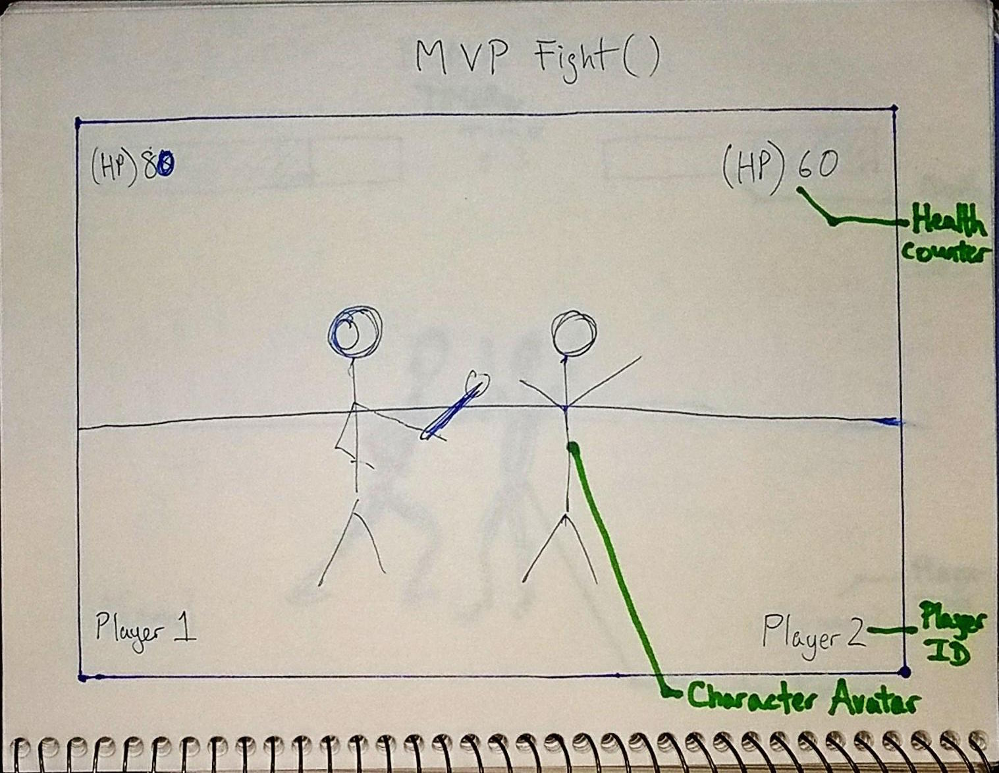

# Project Overview
Day | Deliverable
------------ | -------------
Day 1 Tuesday | Wireframes and Priority Matrix
Day 2 Wednesday | Project Approval / Pseudo Code
Day 3 Thursday | Basic Clickable Model
Day 4 Friday  | Working Prototype
Day 5 Saturday | Final Working Project
Day 6 Sunday | Bugs / Styling / Post MVP
Day 7 Monday | Project Presentations

## Project Description

"Steve Fighter" is a personal rendition of a classic multiplayer arena style 
fighter. Two players face off against one another and use attacks to reduce the 
opponent's Hit Points to zero. The first player to defeat the other wins!

Example of collision detection without using HTML5 Canvas:
* [Pure Javascript 2D Game - Speed Coding Tutorial](https://www.youtube.com/watch?v=Tk3YUimJtbY)
* [Git Hub](https://github.com/Ishtmeet-Singh/Js_game)

Use of vectors:
* [Khan Academy - Vectors](https://www.khanacademy.org/computing/computer-programming/programming-natural-simulations/programming-vectors/a/intro-to-vectors)

## Wireframes

## Priority Matrix

* Hit Detection Logic
* Character Logic (Implementing Hit Detection)
* Character Logic (Implementing Controls)
* Character Hit Point System
* Win Logic
* Landing Page Player Name Input Form
* Character and Level Design
* End Page Design
* End Page User Interface

## Game Components

### Landing Page
When the site is fully loaded, the players will see a the title, "Steve Fighter," 
as a logo. There will be a "Player 1" and "Player 2" name input form with a 
button for submission. Once they have successfully input their names, a "Start" 
button will appear to initialize the game.

### Game Initialization
When the game is initialized, the players will see a "Hit Point" counter which
will dictate how much health their character has remaining. Two character avatars
will be face to face with some distance between them. Their input names from the
landing screen will display in their respective lower corners.

### Playing The Game
Using one hand, the players will be able to control their respective avatars by
using the keyboard. The players will then attempt to reduce their opponent's 
"Hit Points" to zero.

### Winning The Game
When a player successfully reduces his or her opponent's "Hit Points" to zero, he
or she wins the game. They will land on a "Win" screen that displays their name
announcing that they are victorious.  

### Game Reset
On the "Win" screen, they will have the option to restart the fight or go back to
the landing page for new player name inputs.

### MVP
* Landing page will have logo and player input for names 
* Start button will appear after successful name input and begin the game
* Two character avatars at game initialization
* Respective Player Hit Points at upper corners of screen
* Player names in respective lower corners of screen
* Players will reduce each other's Hit Points via attacks
    * Punching only
* When one player reduces the opponent's Hit Points to zero, respective player wins
* End screen displays Player's name as victorious
* Option to replay or return to landing page for new player name input

### POST MVP
* Timer for timeout "Draw" clause
* Health Bar replaces "Hit Point" system
* Expanded attacks
* Enhanced attack animations
* Enhanced character animations
* Enhanced character avatar design
* Enhanced level / background design
* Sound FX for attacks
* Background Music
* Expand number of available Characters
* Character Selection appended to Landing Page
* End screen option to change characters
* Multiple fights per match, best 2 out of 3

## Functional Components
| Component | Priority | Estimated Time | Time Invetsted | Actual Time |
| --- | :---: |  :---: | :---: | :---: |
| 2D Hit-Detection | H | 12hrs | | |
| Win Logic | H | 3hrs | | |
| Character Logic | H | 6hrs | | |
| Health Bar/HP System | H | 6hrs | | |
| Character Design | L | 1hrs | | |
| Level Design | L | 1hrs | | |
| Landing Page Design | L | 1hrs | | |
| End Page Design | L | 1hrs | | |
| End Page UI | L | 1hrs | | |
| Landing Page User Input | M | 3hrs | | |
| Sum Hours | | 35hrs | | |

## Helper Functions
Helper functions should be generic enought that they can be reused in other applications. Use this section to document all helper functions that fall into this category.

| Function | Description | 
| --- | :---: |  
| Capitalize | This will capitalize the first letter in a string | 

## Additional Libraries
 Use this section to list all supporting libraries and thier role in the project. 

## jQuery Discoveries
 Use this section to list some, but not all, of the jQuery methods and\or functionality discovered while working on this project.

## Change Log
 Use this section to document what changes were made and the reasoning behind those changes.  

## Issues and Resolutions
 Use this section to list of all major issues encountered and their resolution.

#### SAMPLE.....
**ERROR**: app.js:34 Uncaught SyntaxError: Unexpected identifier                                
**RESOLUTION**: Missing comma after first object in sources {} object
